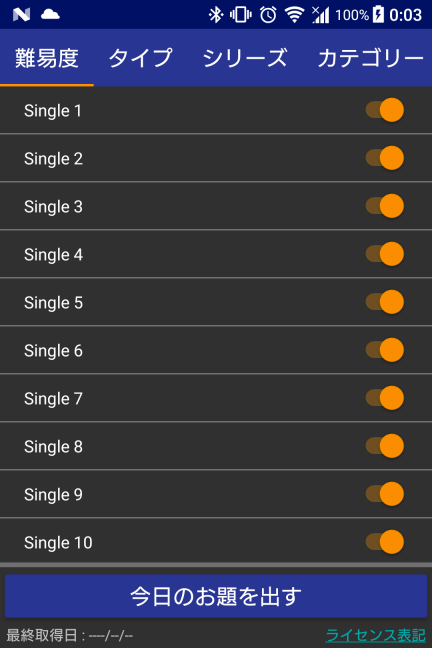
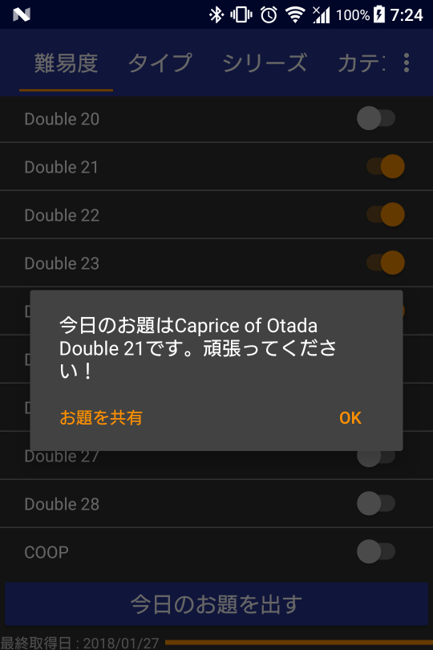

# PIUSubjectChart
  
Pump It Upでの今日のお題を表示・共有するAndroidアプリケーション。譜面データは[PUMP IT UP (JAPAN) Wiki](http://seesaawiki.jp/piujpn/)から取得する。

## インストール
[ここ](https://github.com/infhyroyage/PIUSubjectChart/raw/master/app/release/app-release.apk)からapkファイルをダウンロードし、**Android OS 4.0.3以上**でapkファイルを展開。

## 使い方
  

### お題の絞り込み
以下の5つのグループから、今日のお題を出す譜面を絞り込む。
グループはタブから直接選択するか、左右にフリックして切り替えることが可能。

1. 難易度  
Single譜面はS1〜S26、Double譜面はD1〜D28の範囲で絞り込むことができる。また、**COOP譜面**も絞り込むことができる。
なお、Single Performance譜面はSingle譜面、Double Performance譜面はDouble譜面として扱う。

2. タイプ  
以下の各タイプで絞り込むことができる。
  * Normal(=通常譜面)
  * Remix
  * Full Song
  * Short Cut

3. シリーズ  
Pump It Up PRIME2で分類されている、以下の各シリーズで絞り込むことができる。
  * 1st〜Perfect Collection
  * Extra〜PREX3
  * Exceed〜Zero
  * NX〜NXA
  * Fiesta〜Fiesta EX
  * Fiesta2
  * Prime
  * Prime2

4. カテゴリー  
Pump It Up PRIME2で分類されている、以下の各カテゴリーで絞り込むことができる。
  * original
  * K-POP
  * World Music
  * XROSS
  * J-Music

5. その他  
以下の観点で絞り込むことができる。
  * PP解禁譜面を含む  
Pump It Up PRIME2の公式サイトからPPを消費して解禁する譜面で絞り込むことができる。
  * AM.PASS使用時限定譜面を含む  
AM.PASSで認証してプレイした時に限定してプレイできる譜面で絞り込むことができる。

### 今日のお題を出す
  
「今日のお題を出す」ボタンをタップすると、[PUMP IT UP (JAPAN) Wiki](http://seesaawiki.jp/piujpn/)と通信を行い、絞り込んだ全譜面データを取得する。お題はその譜面データの中から1つだけランダムに選ばれる。  
お題が選ばれると、上記のようにダイアログが表示される(共有可)。

## 制限事項
* 以下の日本限定曲は、お題の対象外。
  - Unlock
  - ヘビーローテーション
* 以下の南米版限定曲は、お題の対象外。
  - Limbo
  - Melodia
  - Que Viva La Vida
